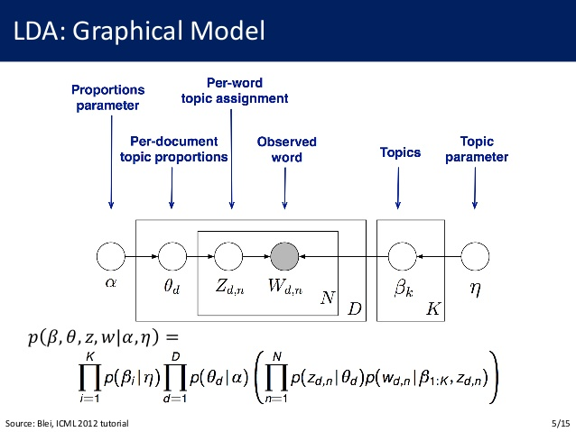

------


This notebook is available on:
https://github.com/epspi/2017.07.25_Cin-Day_RUG_lda

The data is available at census.gov:
https://file.wikileaks.org/file/podesta-emails/

A fully instructive tutorial on `sparklyr` is at:
http://spark.rstudio.com/


------


```{r setup, include = F}

# Java options
options(java.parameters = "-Xmx12G")

# Libraries
library(sparklyr)
library(dplyr)
library(janeaustenr)
```


# What is LDA?

LDA (Latent Dirichlet Allocation) is a set of models for describing textual 
documents according to what "topics" those documents are about. 

* A topic can be thought of as a collection of keywords most central to the document
* Topics are actually distributions over the entire vocabulary 
* Describing a document by its consituent topics instead of its underlying words
is akin to finding a latent space for the corpus of documents
* LDA is frequently compared with Latent Semantic Analysis (PCA) for this reason

In short:  

* **Each DOCUMENT is described by a distribution over TOPICS** 
* **Each TOPIC is a distribution over WORDS**

------


### LDA as a Generative Model


------


### LDA as a Probabilistic Graphical Model



# LDA in Spark

We connect to spark as usual, but I've found that it's important to set the memory
allowance to something respectable
```{r, Spark Connection}
# options(java.parameters = "-Xmx12G") # REMEMBER!!!!!
config <- spark_config()
# config$spark.executor.memory <- "4G"
config$spark.driver.memory <- "10G"
config$`sparklyr.shell.driver-memory` <- "10G"
sc <- spark_connect(master = "local", version = "2.1.0", hadoop_version = "2.7",
                    config = config)
```

------

### What's available for text in the sparklyr API?
LDA is a model that runs on a `bag-of-words` representation of a text document,
typically stored as a sparse matrix (a *Term-Document Matrix* or a equivalently a 
*Document-Term* matrix):  

* Each row (column) is a vocabulary word
* Each column (row) is a document
* The values in the matrix represent the counts of the words in the documents

In order to get to this representation, we need (*at a minimum*) two utilities: 

* a *tokenizer*: something that extract tokens (words or n-grams) from free text
* a *token counter*: something that counts the occurences of each token in each document

Spark facilitates this with `ft_tokenizer` and `ft_count_vectorizer`

------

### Using sparklyr on Jane Austen Data

The package `janeaustenr` contains full text of Jane Austen's 6 books in a single dataframe

```{r}
austen_books <- austen_books()
austen_books %>% count(book) %>% rename(Lines = n)

head(austen_books, 40)
```

In this dataframe, each row is one line of text from a book, which is too small a 
chunk of text for the purposes of our analysis -- to understand what each chunk of text is "about".
We aggregate the text by book, instead

```{r}
austen_books <- austen_books %>% 
  filter(nchar(text) > 0) %>% 
  group_by(book) %>% 
  summarise(text = paste0(text, collapse = " "))

```


------

The data frame is copied to spark as usual, and we deal with the blank rows 

```{r}
books_tbl <- sdf_copy_to(sc, austen_books, overwrite = TRUE)

tdm  <- books_tbl %>%
  ft_tokenizer("text", "tokens") %>%
  ft_count_vectorizer("tokens", "features") 
```

```{r}
lda_mod <- tdm %>%   
  ml_lda("features", k = 10)

lda_mod
```


